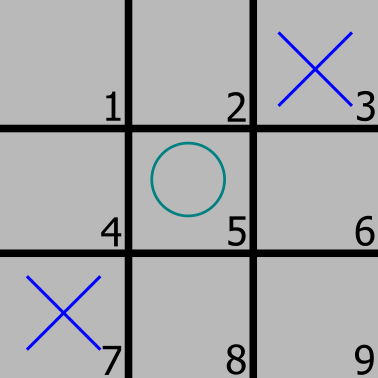

<style>
img[alt~="center"] {
  display: block;
  margin: 0 auto;
}
.col2 {
    display: grid;
    grid-template-columns: repeat(2, minmax(0, 1fr));
    gap: 1rem;
}
.col3 {
    display: grid;
    grid-template-columns: repeat(3, minmax(0, 1fr));
    gap: 1rem;
    align-items: center;
    jystify-content: center;
}

.col4 {
    display: grid;
    grid-template-columns: repeat(4, minmax(0, 1fr));
    gap: 1rem;
}
</style>

# Week 1

Reinforcement learning is how we train AI to make decisions.

---

# Tic Tac Toe


---

# Rainbow Six: Siege


---

# Policy

A policy comes from experience that allows you to make decisions.

You have a policy for tic tac toe because you have played many times before, but you also understand the game.

---

# Understanding a Game

When you make a move in ttt, you automatically look ahead, because you understand the game. **Is 3 or 6 a better move for x?**


---

# Another Example

Is 1 or 2 a better move for o?



---

# Reward

By looking ahead, you calculate the move that will produce the most reward. By being rewarded, the AI will learn what moves are good and bad.

Reward can be positive or negative.

A move that makes you win sooner gives more reward (not applicable to ttt).

---

# Information

_What information is available (to the AI)?_

State: what the board looks like

All possible actions: place a tile in squares 1-9

_What can be derived from state and all actions?_

All possible actions given the state.

---

# Derive More Information

o can place a tile in 1, 2, 4, 6, 8, or 9


_Why is this important?_

---

# Mao

A card game where you learn the rules by getting penalized.

You start out not knowing the rules and slowly learn.

A lot harder to learn compared to if you knew the rules to begin with.

---

# Remembering Moves

The AI needs to remember the moves it made to get to the current state because if it wins, it needs to know what moves it made to get there.

It will positively change the reward of those moves with more recent moves getting more rewar.

---

# State


---

# How the AI makes a decisions

```py
pred = model.predict(...)
print(pred)
>>>
[
    .1, .9, .0,
    .9, .0, .9,
    .0, .9, .1
]
idx = np.argmax(pred)
print(idx)
>>> 1
```

---

# State represented in code

```python
state = [
    # x spaces
    0,0,1,
    0,0,0,
    1,0,0,
    # o spaces
    0,0,0,
    0,1,0,
    0,0,0,
    # legal moves
    1,1,0,
    1,0,1,
    0,1,1
]
```

---

# Snake state

_What state is available?_

- Snake position
- Body position
- Wall position
- **Apple position**
- **Current direction**
- **Danger position**

---

# Snake Actions

_What actions are available?_

<div class="col3">
<ul>
<li>Move up</li>
<li>Move down</li>
<li>Move left</li>
<li>Move right</li>

</ul>
<b style="text-align:center;margin:auto">or</b>
<ul>
<li>turn left</li>
<li>turn right</li>
<li>continue straight</li>
</ul>

</div>

---

# Snake Reward

Eat food: +10

Die: -100

It won't sacrifice itself to eat food if the penalty is much higher than the reward. This will make the snake live longer (a future problem for future us).

---

# Code

```python
state = [
    # Danger forward/right/left
    0,0,0,0
    # moving up/down/right/left
    0,0,0,0
    # food up/down/right/left
    0,0,0
]
```
